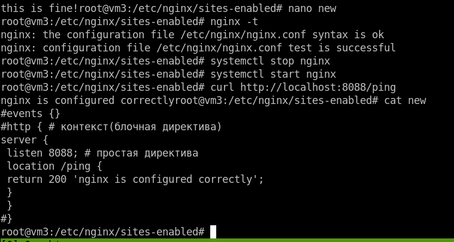

# Домашнее задание к занятию "`Балансировка нагрузки. HAProxy/Nginx`" - `Живарев Игорь`

### Задание 1

`В вычислительной технике балансировка нагрузки улучшает распределение рабочих нагрузок по нескольким вычислительным ресурсам: компьютерам, компьютерным кластерам, сетевым подключениям, центральным процессорам или дисковым устройствам. Балансировка нагрузки призвана оптимизировать использование ресурсов, максимально увеличить пропускную способность, минимизировать время отклика и избежать перегрузки отдельных ресурсов. Применение вместо одного компонента нескольких компонентов с балансировкой может повысить надёжность и доступность благодаря получившемуся запасу мощностей. Балансировка нагрузки обычно подразумевает использование специального ПО или оборудования вроде многоуровневого коммутатора или DNS-сервера.`

`Это определение применимо ко всем аспектам обработки данных, а не только к работе с сетью. Операционные системы используют балансировку для диспетчеризации задач среди нескольких физических процессоров. Контейнерные оркестраторы вроде Kubernetes используют балансировку для диспетчеризации задач среди нескольких вычислительных кластеров. А сетевые балансировщики распределяют сетевые задачи среди доступных бэкендов.`

### Задание 2

`Round Robin, или алгоритм кругового обслуживания, представляет собой перебор по круговому циклу: первый запрос передаётся одному серверу, затем следующий запрос передаётся другому и так до достижения последнего сервера, а затем всё начинается сначала.`

`Weighted Round Robin — усовершенствованная версия алгоритма Round Robin. Суть усовершенствований заключается в следующем: каждому серверу присваивается весовой коэффициент в соответствии с его производительностью и мощностью. Это помогает распределять нагрузку более гибко: серверы с большим весом обрабатывают больше запросов. Однако всех проблем с отказоустойчивостью это отнюдь не решает. Более эффективную балансировку обеспечивают другие методы, в которых при планировании и распределении нагрузки учитывается большее количество параметров.`

### Задание 3

### Задание 4

### Задание 5

